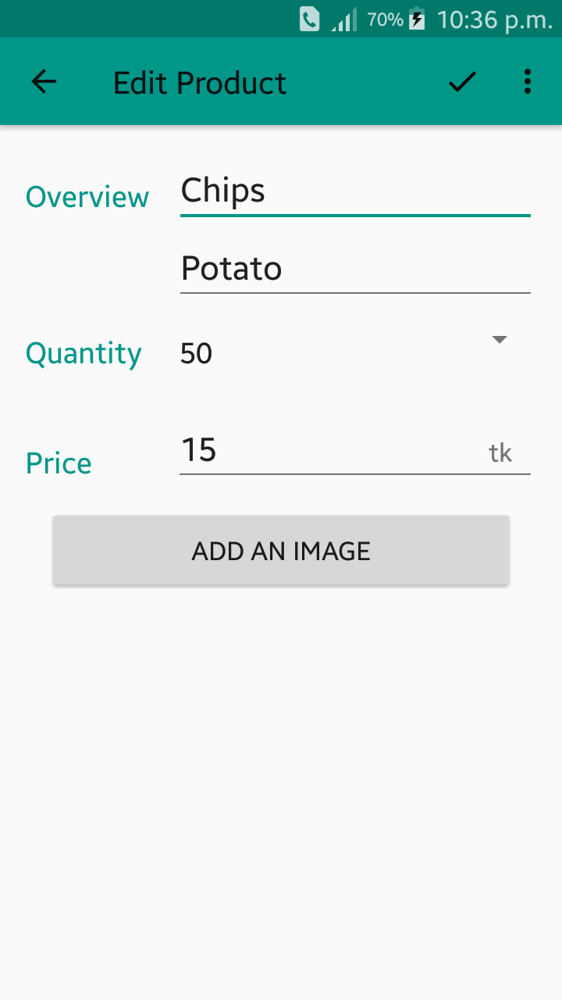

# InventoryApp
This is an offline application for shopkeepers where they can keep their product records. Such as: product name, product description(like brand name), product quantity, price of the product and finally can add a picture of that product. They can also edit or delete their product details anytime they want.

## Home Screen
This is an empty home screen of the application. User can add product by clicking on that plus(+) floating button.

### Home Screen Menu
This is a menu in the home screen. There are two options. Either user can insert dummy data or user can delete all product at a time.

## Adding Product
After clicking on that plus(+) floating button, user will be taken to this page. Then he/she has to give product details to add a product. And finally by clicking on that tick button user can save the product

## All Product List
After adding products, all the products will be shown in the home page as a list.

## Edit Product
By clicking on a product user can edit a product like changing it's name, description, quantity, price or the picture.

### Discard Confirmation
After editing if a user click the back button without saving, then it will ask for discard confirmation.

## Delete Product
If user wants to delete a single product, he/she has to choose a product by clicking on that and then in the menu of the edit product activity there is an option named delete product. 

### Delete Confirmation
By clicking on that delete product option in the menu, user can delete that particular product. It will also ask for confirmation.

